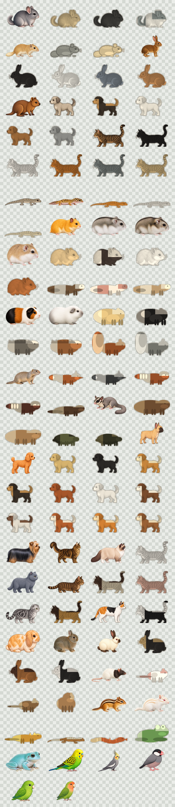

# Animals Desktop

Animals Desktopは、DeguDesktopをベースにしたWindowsデスクトップペットアプリです。軽量なWin32タスクバーオーバーレイ、トレイ操作、キーボード反応、ランダム散歩、ホイール、名前表示、採餌、グルーミングを保ちながら、選べる動物を100バリアントまで広げています。

This is a Go desktop-pet app based on the DeguDesktop taskbar pet. It keeps the lightweight Win32 overlay, tray menu, keyboard reaction, random stroll, wheel, names, and foraging behavior, then expands the selectable art from degu coats into multiple real animal species.

Repository: <https://github.com/UDteach/AnimalsDesktop>
GitHub Pages: <https://udteach.github.io/AnimalsDesktop/>

## Current Catalog

The runtime catalog currently includes exactly 100 selectable variants:

- 11 degu motion variants: wild agouti, black, blue/slate gray, gray, white/cream, sand/champagne, chocolate, and pied variants
- 89 seed-stage variants across chinchilla, macaroni mouse / fat-tailed gerbil, rabbit, dog, cat, gecko, hamster, ferret, guinea pig, hedgehog, squirrel, fox, red panda, otter, sugar glider, capybara, tortoise, rat, mouse, gerbil, prairie dog, chipmunk, bearded dragon, crested gecko, corn snake, and White's tree frog
- Popular breed/color additions such as French Bulldog fawn, Labrador yellow/black, Golden Retriever golden, Maine Coon brown tabby, Ragdoll seal bicolor, Holland Lop broken orange, Fancy rat hooded, Bearded dragon citrus, Corn snake amelanistic, and White's tree frog green

Non-degu species are seed-stage assets generated from source-truth still images, tint-controlled variants, or deterministic shape sources. They are selectable in the app and have deterministic runtime sheets. Each variant is assigned an ecology-specific motion profile, including dog-trot, cat-stalk, rabbit-hop, gecko-crawl, snake-slither, dragon-plod, frog-hop, and other profile groups.



## Release Focus

The first 100-variant release prioritizes the small desktop-pet families that best fit the original taskbar-pet feel: chinchillas, macaroni mice / fat-tailed gerbils, hamsters, and geckos. The public site now lists the added animals and the next ImageGen pass order. 次の重点キューには、モモンガ系と小鳥系（桜文鳥、白文鳥、セキセイインコ、オカメインコ、コザクラインコ、キンカチョウ）も入れています。

Next art passes should replace prototype seed art with accepted source-truth motion sets in this order: chinchilla, macaroni mouse, hamster, gecko, momonga / flying squirrel family, small birds, popular dogs, popular cats, rabbits, small animals, reptiles, and amphibians.

ImageGen batching should now favor fewer animals per thread with more candidates per animal: 4-6 variants x 4 source candidates for source review, then 1 species family x 1-3 variants x 62 frames for motion.

## Windows Features

- Transparent always-on-top pet layer above the Windows taskbar
- Tray menu and Japanese/English settings window
- 1-10 visible pets
- Fixed, per-pet, or random animal/color selection
- Optional per-pet names with hover labels
- Keyboard reaction and random stroll modes
- Typing wheel behavior
- Species behavior profiles: only wheel-capable profiles enter the typing wheel, so low-crawler, snake, frog, tortoise, large, and companion profiles do not get forced into degu-only actions
- Foraging, carrying, eating, digging, gnawing, and grooming behavior
- GitHub Release based update check and installer path

The executable entrypoint is still `./cmd/degu` while the codebase is being migrated from DeguDesktop naming.

## Asset Pipeline

Degu motion assets use the original frame importer:

```powershell
go run ./cmd/importsheet
```

It reads `assets/source/frames/wild_agouti`, coat guides, forage art, and wheel/icon sources, then writes `assets/sprites/degu_*.png`, `assets/tray.ico`, `docs/assets/degu-preview.png`, and `assets/source/import-report.json`.

Seed animal assets use:

```powershell
go run ./cmd/importanimals
```

It reads source-truth images recorded under `docs/art-source`, `docs/art-intake`, and `docs/source-truth`, applies catalog tint/shape settings, then writes:

- `assets/sprites/<animal>_set00.png` through `set09.png`
- `assets/source/animals/generated/<animal>-source.png`
- `assets/source/animals/seed-import-report.json`
- `docs/assets/animalsdesktop-seed-preview.png`

The shared runtime registry is in `internal/catalog`. It owns the fixed 100-variant manifest, species metadata, breed/morph labels, color labels, popularity tiers, source status, motion-profile assignment, and wheel-capability decisions. The Windows renderer uses a lazy sprite cache, so adding many variants does not expand every sprite sheet into RGBA frames at startup.

## Development

```powershell
go run ./cmd/importsheet
go run ./cmd/importanimals
go test -buildvcs=false ./...
go vet -buildvcs=false ./...
go build -buildvcs=false -ldflags="-H=windowsgui" -o dist\AnimalsDesktop.exe ./cmd/degu
```

Run the app locally:

```powershell
go run ./cmd/degu
```

## Release

Push a `v*` tag to build Windows release ZIPs via GitHub Actions. The Windows app checks `UDteach/AnimalsDesktop` Releases for the latest matching architecture zip.

Expected release assets:

- `AnimalsDesktop-windows-amd64.zip`
- `AnimalsDesktop-windows-386.zip`

macOS packaging scripts are still present from the baseline and have been renamed to AnimalsDesktop, but current multi-species validation is Windows-first.

## Cloudflare Pages

`wrangler.jsonc` points at `docs/` for the AnimalsDesktop static output directory. GitHub Pages deploys from the `GitHub Pages` workflow. The `sites/kdevelopk/` folder is a lightweight source for the personal `kdevelopk.pages.dev` works page when that Cloudflare Pages project needs to be refreshed.
